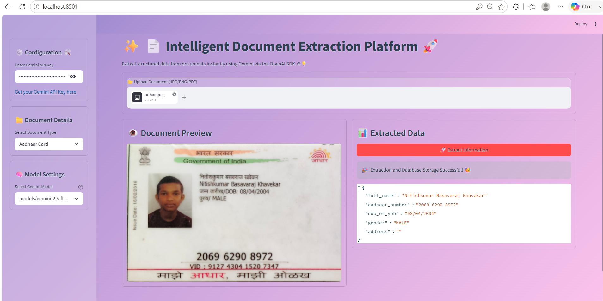
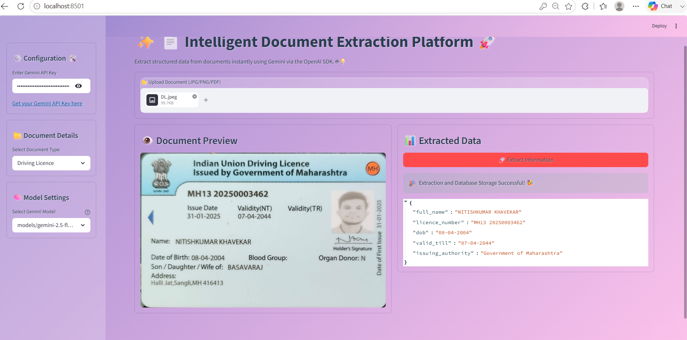
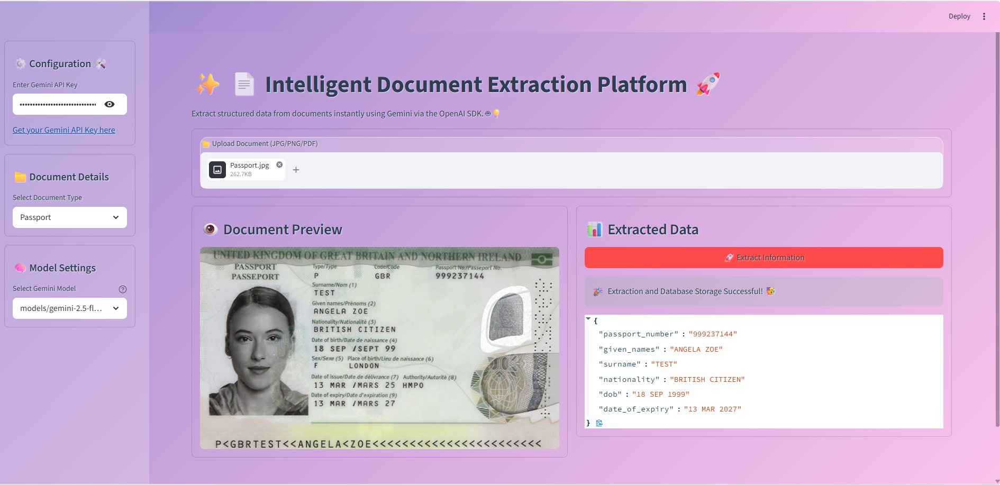
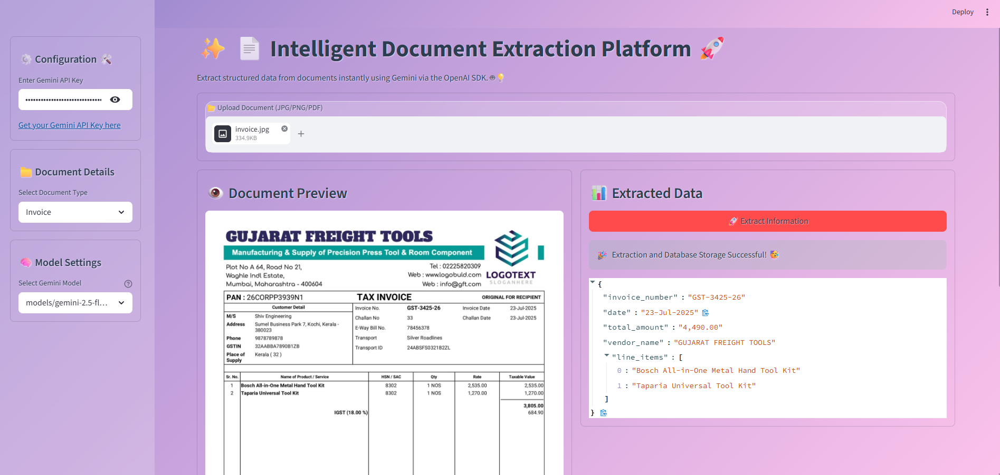
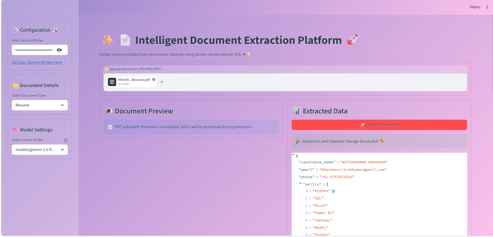

# ✨ Intelligent Document Extraction Platform 🚀

A Python-based intelligent document extraction platform that uses Google's Gemini Vision models to scan, process, and extract structured information from various document types. The application is built with a focus on clean architecture, SOLID principles, and modern design patterns, all presented through a beautiful and interactive Streamlit user interface.

## 🌟 Features

-   **Multi-Document Support**: Extract data from various document types:
    -   Aadhaar Card
    -   Driving Licence
    -   Passport
    -   Invoice
    -   Resume
-   **Multi-Format Upload**: Supports `JPG`, `PNG`, and `PDF` file formats.
-   **Advanced OCR & LLM Integration**: Leverages the power of Google Gemini for state-of-the-art OCR and data extraction in a single step.
-   **Dynamic Model Selection**: Automatically fetches and lists available Gemini models to ensure compatibility and prevent errors.
-   **Template-Based Extraction**: Uses Pydantic schemas to define and enforce the structure of the extracted data, making the output fields easily configurable.
-   **Database Storage**: Automatically stores all extracted information in a local SQLite database for persistence and future use.
-   **Engaging UI**: A beautiful, colorful, and responsive user interface built with Streamlit, featuring a "Glassmorphism" theme.
-   **Robust Architecture**:
    -   Follows **SOLID** principles for maintainable and scalable code.
    -   Implements **Design Patterns** like Strategy, Factory, and Decorator.
    -   Uses **Aspect-Oriented Programming** for clean logging and exception handling.

## 🏗️ Project Structure

The project is organized into distinct modules, each with a single responsibility, making it easy to understand and extend.

```
e:\intelligent-document-extractor\
│
├── requirements.txt      # Project dependencies
├── README.md             # This file
├── setup_project.py      # Script to generate the project structure
├── utils.py              # Logging and exception handling decorators
├── database.py           # SQLAlchemy models and database manager
├── schemas.py            # Pydantic schemas for document data structures
├── extractors.py         # Strategy & Factory for the extraction logic
└── app.py                # The main Streamlit user interface
```

## 🛠️ Setup and Installation

Follow these steps to get the application running on your local machine.

### 1. Prerequisites

-   Python 3.8+
-   An active Google Gemini API Key.

### 2. Installation

Clone the repository or create the files as provided. Then, navigate to the project directory and install the required dependencies.

```bash
# Navigate to your project folder
cd path/to/intelligent-document-extractor

# Install dependencies
pip install -r requirements.txt
```

### 3. Get Your API Key

-   Visit the Google AI Studio to generate your Gemini API key.
-   The application has a pre-filled key for convenience, but it's recommended to replace it with your own.

### 4. Run the Application

Launch the Streamlit app from your terminal:

```bash
streamlit run app.py
```

Your browser should automatically open a new tab with the running application.

## 🚀 How to Use

1.  **Launch the app**.
2.  The **Gemini API Key** is pre-filled in the sidebar. You can change it if needed.
3.  Select the **Document Type** you wish to extract from the dropdown menu.
4.  Choose a **Gemini Model**. The list is populated dynamically based on what's available for your key. `gemini-1.5-flash` is recommended for speed.
5.  **Upload** your document file (`.jpg`, `.png`, or `.pdf`).
6.  A preview of the document will appear.
7.  Click the **"🚀 Extract Information"** button.
8.  The extracted data will be displayed in a structured JSON format and is automatically saved to the `documents.db` file. A success animation will play!

## 📸 Screenshots


Here is a preview of the Intelligent Document Extraction Platform processing different document types:

| **Aadhaar Card Extraction** | **Driving Licence Extraction** |
| :---: | :---: |
|  |  |

| **Passport Extraction** | **Invoice Processing** |
| :---: | :---: |
|  |  |

| **Resume Parsing** |
| :---: |
|  |
